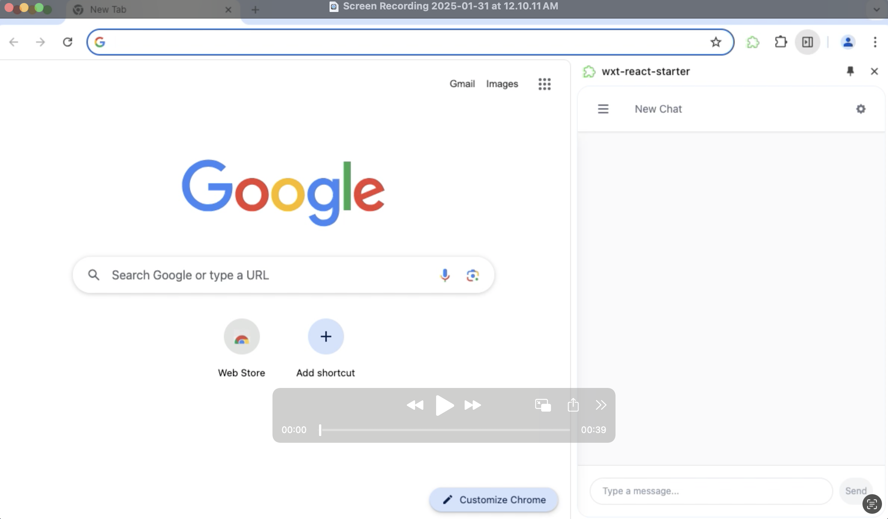

# Browsy - Your Personal Browser Companion

Meet Browsy, your friendly and intelligent browser assistant that's always ready to help. This Chrome extension understands natural conversations and assists you with your daily browsing needs, making your online experience more personal and effortless.

## What Browsy Can Do For You

- 💬 Chat naturally about what you need help with
- 🔍 Find information and answers while you browse
- 🎯 Help with daily browsing needs
- 🧠 Remember your preferences and improves overtime
- 🤝 Work alongside you on any webpage
- 🔒 Keep your conversations and settings private

## Demo
[](./doc_assets/demo.mp4)

## Installation

1. Clone this repository
2. Install dependencies:
   ```bash
   pnpm install
   ```
3. Build the extension:
   ```bash
   pnpm build
   ```
4. Load the extension in Chrome:
   - Open Chrome and navigate to `chrome://extensions/`
   - Enable "Developer mode"
   - Click "Load unpacked"
   - Select the `dist` directory from the project

## Configuration

1. After installation, click on the extension icon
2. Go to the options page
3. Enter your OpenAI API key
4. Save the settings

## Development
### Prerequisites

- Node.js
- pnpm
- Chrome browser

### Development Commands

```bash
# Start development server
pnpm dev

# Build for production
pnpm build

# Create distribution zip
pnpm zip

# Type checking
pnpm compile
```

### Project Structure

- `/entrypoints` - Extension entry points (background, content scripts, popup)
- `/common` - Shared utilities and hooks
- `/assets` - Static assets
- `/public` - Public assets (icons, etc.)

## Tech Stack

### Frontend
- React - UI framework
- TypeScript - Type-safe JavaScript
- TailwindCSS - Utility-first CSS framework
- WXT - Modern Chrome Extension Framework

### AI & Machine Learning
- OpenAI + Vercel AI SDK - For agent implementation
- LangChain + WebLLM - For local LLM inference for small tasks
- Transformers - For local text embeddings

### Storage & State Management
- PouchDB - For efficient local data storage
- IndexedDB - For vector storage
